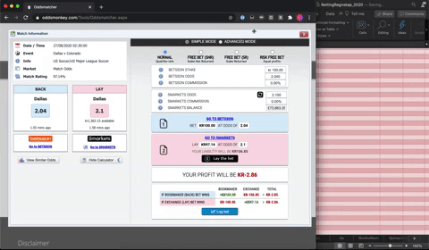

# Betting_regnskap

## How to
Clone repoet til din lokale maskin. Lag en extension i Chrome. ***Denne guiden oppdateres***
Koden antar et regneark der spillsiden er likt som template-regnearket som ligger i repoet

## To Do
1. Integrer redigering av gnomes
2. Fiks slik at freebets kommer med(kopier kildekode fra excel og legg dette inn i copy-stringen? da slipper man også å fylle inn bakgrunnskode i etterkant)
3. skaff bilde til symbolet
4. Gjør online

## Proof of Concept

